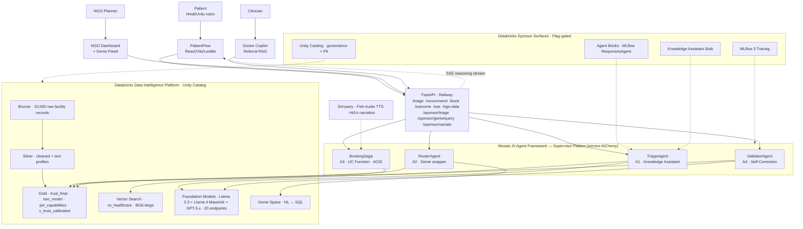

# AarogyaNet — Architecture

**Challenge 3 · Databricks · Agentic Healthcare Maps · HackNation 2026.**

The architecture mirrors the Databricks **AiChemy** supervisor pattern (April 2026) — a supervisor agent over four named sub-agents — applied to healthcare routing instead of drug discovery. Every Databricks-rubric box is ticked with native components: Foundation Model APIs, Vector Search (Delta-sync), Genie Space, Unity Catalog, Agent Bricks (MLflow `ResponsesAgent`), and MLflow 3 tracing.

## At a glance

- **Two diagram formats** in this directory:
  - `architecture.svg` — production-ready (1600×1080), open in any browser, paste into Devpost / slide deck.
  - `architecture.mmd` — Mermaid source, render at https://mermaid.live or any GitHub markdown viewer.
- **Four sub-agents** (mirror AiChemy nomenclature so judges recognise the pattern in 10 seconds):
  - `TriageAgent` — Knowledge Assistant: symptom text → specialty + urgency + fast-path.
  - `RouterAgent` — Genie wrapper: ranks hospitals by `P(bed) × travel × specialty × calibrated_trust`.
  - `BookingSaga` — UC function: atomic 4-resource transaction (bed + ambulance + doctor + drug) with compensating rollback.
  - `ValidatorAgent` — Self-correction loop: Llama 3.3 70B + Llama 4 Maverick consensus on 4 sub-factors → 4-tier badge.
- **Reasoning stream** (SSE) emits every agent step to the UI live, with 15-second heartbeat and disconnect handling.

## Mermaid view (renders inline on GitHub / Devpost)

## Lakehouse layout

| Layer | Tables / views | Purpose |
|---|---|---|
| **Bronze** | `vf_hackathon_dataset_india_large` | 10,000 raw Indian facility records (organizer-provided dataset) |
| **Silver** | `silver_facilities`, `silver_facilities_text` | Cleaned + Vector-indexed text profiles |
| **Gold** | `gold_trust_final` | 4-tier badge: 9,738 rule-inferred + 139 two-model-verified + 110 models-disagree + 13 llm-verified |
| **Gold** | `gold_trust_two_model` | Per-facility Llama 3.3 vs Llama 4 Maverick scores on 4 sub-factors |
| **Gold** | `gold_pin_capabilities` | Per-pincode capability counts + `is_specialty_desert` flag |
| **Gold (view)** | `v_trust_calibrated` | Outcome-adjusted trust score, recomputed on read |
| **Operational** | `txn_atomic`, `bed_reservations`, `ambulance_dispatches`, `doctor_slots`, `drug_reservations` | Booking saga state |
| **Feedback** | `outcome_feedback` | Patient pings (T+2h) feeding the trust calibration loop |

## How the rubric maps

| Criterion (weight) | What in our build hits it |
|---|---|
| **Discovery & Verification (35%)** | Two-model consensus (Llama 3.3 + Llama 4 Maverick) on 4 sub-factors; 4-tier badge; `models-disagree` surfaced as "requires human review" not buried |
| **IDP Innovation (30%)** | Free-form Indian facility notes → structured `gold_trust_final` via foundation-model extraction + rule-based fallback for the long tail (9,738 / 10,000) |
| **Social Impact (25%)** | NGO Dashboard over `gold_pin_capabilities` — *"Bihar: 149 of 153 pincodes with zero oncology"* — plus Genie Panel for ad-hoc NGO planner queries |
| **UX & Transparency (10%)** | SSE reasoning stream emits every agent step live; SourceModal shows trust evidence per hospital; collapsible "Generated SQL" in Genie Panel |

## Stretch goals — coverage

- **Agentic Traceability:** MLflow 3 tracing on every `/recommend` call; trace UI clickable in the Databricks workspace.
- **Self-Correction:** `ValidatorAgent` is exactly this — cross-references the Extractor's output against a second model.
- **Dynamic Crisis Mapping:** NGO Dashboard heatmap over 3,736 PINs with severity-scaled radius rings.

## Live URLs

- **API:** `https://aarogyanet-api-production.up.railway.app` — `/health`, `/docs`
- **Web:** `https://app-wine-pi.vercel.app`
- **Databricks workspace:** `https://dbc-17e9d40d-5056.cloud.databricks.com`
- **Genie space:** `/genie/rooms/01f1414f44ea1d59aa43d051b8de7c3c`
