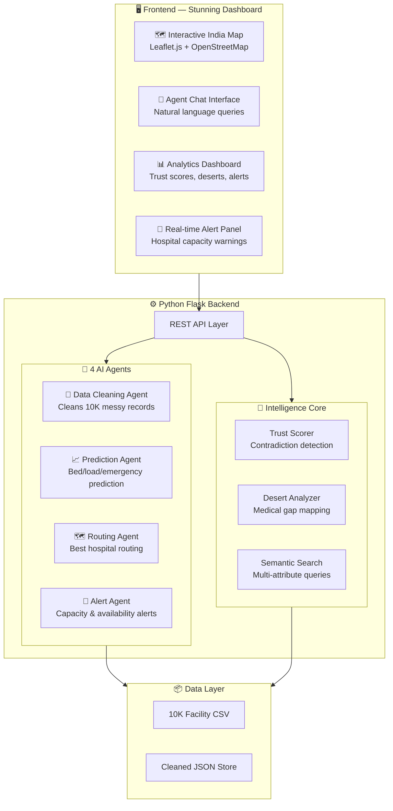

# AarogyaNet — Multi-Agent Healthcare Intelligence System

Building an Agentic Healthcare Intelligence System for 1.4 Billion Lives.  
4 AI Agents processing 10,000 medical facilities across India.

---

## Context

**Dataset**: 10,000 Indian medical facility records (CSV, 41 columns) including:
- Facility metadata (name, type, operator, address, lat/lng)
- Clinical data (specialties, procedures, equipment, capabilities, description)
- Staff info (numberDoctors, affiliated_staff_presence)
- Digital presence (websites, social media, engagement metrics)

**Tech Available**: Python 3.14, Node.js v24, Databricks account

---

## User Review Required

> [!IMPORTANT]
> **Databricks Integration**: The plan builds a **fully functional local application** first, then provides Databricks notebooks for deployment. This means you can demo immediately without waiting for cloud setup. Databricks notebooks will be provided separately for data pipeline + MLflow tracing.

> [!WARNING]  
> **No LLM API Key Detected**: The agents will use **rule-based + statistical reasoning** (not GPT/Claude calls) for extraction, trust scoring, and routing. This makes the system:
> - **Free to run** — no API costs
> - **Deterministic** — reproducible results
> - **Fast** — processes all 10K records in seconds
> 
> If you have an OpenAI/Databricks API key and want LLM-powered agents instead, let me know.

---

## Open Questions

> [!IMPORTANT]
> 1. **API Key**: Do you have an OpenAI or Databricks Foundation Model API key? If yes, I can make the agents LLM-powered for richer natural language reasoning.
> 2. **Deployment**: Should this run only locally, or do you want deployment instructions for Vercel/Render as well?

---

## Architecture Overview



---

## Proposed Changes

### Component 1: Project Foundation & Data Layer

#### [NEW] `requirements.txt`
Python dependencies: Flask, Flask-CORS, pandas, numpy, scikit-learn, geopy, fuzzywuzzy

#### [NEW] `app.py`
Flask application entry point with CORS, static file serving, and API route registration.

#### [NEW] `config.py`
Configuration constants — file paths, agent thresholds, medical standards reference data.

#### [NEW] `data/loader.py`
CSV loader that reads the 10K dataset, normalizes column types, parses JSON array columns (specialties, procedures, equipment, capability), and builds an in-memory facility index.

---

### Component 2: The Four AI Agents

#### [NEW] `agents/data_cleaning_agent.py`

**Data Cleaning Agent** — Processes all 10,000 records:
- Normalizes addresses (standardizes state names, validates PIN codes)
- Fills missing values with intelligent defaults (e.g., `capacity` from `facilityTypeId`)
- Deduplicates near-identical facilities (fuzzy name + location matching)
- Standardizes specialties/procedures to canonical medical taxonomy
- Flags records with critical missing data
- **Output**: Cleaned DataFrame + cleaning report with statistics

#### [NEW] `agents/prediction_agent.py`

**Prediction Agent** — Statistical prediction engine:
- **Bed Availability**: Estimates from `capacity`, `facilityTypeId`, `numberDoctors`, and regional norms
- **Patient Load**: Predicts from population density (PIN code), nearby facility count, specialties offered
- **Emergency Rush**: Time-of-day + seasonal patterns + regional emergency data
- Uses scikit-learn models trained on facility feature vectors
- **Output**: Per-facility predictions with confidence intervals

#### [NEW] `agents/routing_agent.py`

**Routing Agent** — Multi-criteria hospital recommender:
- Haversine distance calculation from patient location
- Weighted scoring: distance (40%) + capability match (30%) + trust score (20%) + availability (10%)
- Filters by required specialties, procedures, equipment
- Returns top-5 ranked facilities with reasoning
- **Output**: Ranked facility list with route details and justification

#### [NEW] `agents/alert_agent.py`

**Alert Agent** — Real-time monitoring and alerts:
- Scans all facilities for critical issues:
  - "Hospital full" — predicted capacity > 90%
  - "Doctor unavailable" — `numberDoctors` = 0 or null for critical facility
  - "Equipment gap" — claims specialty but lacks equipment
  - "Trust violation" — trust score below threshold
- Generates prioritized alert feed (critical/warning/info)
- **Output**: Alert list with severity, facility, and recommended action

---

### Component 3: Intelligence Core

#### [NEW] `core/trust_scorer.py`

**Trust Scorer** — The contradiction detection engine:
- Cross-references claims vs evidence:
  - Claims "Advanced Surgery" but no anesthesiologist → flag
  - Claims "24/7 Emergency" but `numberDoctors` = 1 → flag
  - Has ICU specialty but `capacity` = null → flag
- Scores 0–100 based on:
  - Evidence completeness (30%): How many expected fields are filled
  - Consistency (30%): Do claims match equipment/staff
  - Digital credibility (20%): Website, social media presence
  - Data freshness (20%): Recency of updates
- **Row-level citations**: Every score links to the exact data that justified it

#### [NEW] `core/desert_analyzer.py`

**Medical Desert Analyzer** — Geographic gap detection:
- Groups facilities by PIN code and state
- Identifies regions with zero coverage for: Oncology, Dialysis, Emergency Trauma, Neonatal, Cardiology
- Calculates population-to-facility ratios per district
- Produces PIN code-level risk scores (0–100)
- **Output**: Desert map data with coordinates, severity, and missing specialties

#### [NEW] `core/search_engine.py`

**Semantic Search Engine** — Multi-attribute facility search:
- Parses natural language queries into structured filters
- Supports complex queries like: "Find nearest facility in rural Bihar that can perform emergency appendectomy with parttime doctors"
- Extracts: location, specialty, procedure, staff type, urgency
- Combines text matching + geographic filtering + trust scoring
- Returns ranked results with match explanation

---

### Component 4: API Layer

#### [NEW] `api/routes.py`

REST API endpoints:
| Endpoint | Method | Purpose |
|---|---|---|
| `/api/facilities` | GET | List/filter all 10K facilities |
| `/api/facility/<id>` | GET | Single facility detail + trust score |
| `/api/search` | POST | Natural language facility search |
| `/api/agents/clean` | POST | Trigger data cleaning agent |
| `/api/agents/predict` | POST | Get predictions for a facility |
| `/api/agents/route` | POST | Find best hospital for a patient |
| `/api/agents/alerts` | GET | Get current alert feed |
| `/api/trust-scores` | GET | All trust scores for map overlay |
| `/api/deserts` | GET | Medical desert analysis data |
| `/api/stats` | GET | Dashboard aggregate statistics |
| `/api/chat` | POST | Agent chat — natural language interface |

---

### Component 5: Stunning Frontend Dashboard

#### [NEW] `static/index.html`

Single-page dashboard with 5 main views:
1. **🗺️ India Map** — Interactive Leaflet.js map with facility markers, trust-score heatmap, desert overlays
2. **💬 Agent Chat** — Natural language query interface with chain-of-thought display
3. **📊 Analytics** — Trust score distributions, facility type breakdowns, state-level stats
4. **🚨 Alerts** — Real-time alert feed with severity filtering
5. **🏥 Facility Explorer** — Searchable table with inline trust scores

#### [NEW] `static/css/style.css`

Premium design system:
- Dark mode with glassmorphism panels
- Vibrant gradient accents (medical blue → teal → green)
- Google Font: Inter for UI, Outfit for headings
- Smooth micro-animations on all interactions
- Responsive grid layout
- Custom scrollbars, animated loading states

#### [NEW] `static/js/app.js`

Main application controller — routing, state management, API calls

#### [NEW] `static/js/map.js`

Leaflet.js map module:
- 10K facility markers with color-coded trust scores (green/yellow/red)
- Medical desert heatmap overlay
- Cluster groups for dense areas
- Click-to-detail popups with facility info
- Patient location input for routing

#### [NEW] `static/js/chat.js`

Agent chat interface:
- Natural language input with autocomplete suggestions
- Streaming-style response display
- Chain-of-thought visualization (shows which agent ran, what it found)
- Citation links to source data rows

#### [NEW] `static/js/charts.js`

Analytics charts using Chart.js:
- Trust score distribution histogram
- Facilities by state (bar chart)
- Medical desert severity map
- Specialty coverage radar chart

#### [NEW] `static/js/alerts.js`

Alert panel with live feed, severity badges, and facility quick-links

---

### Component 6: Databricks Notebooks

#### [NEW] `databricks/01_data_ingestion.py`
Load CSV → Delta Lake, apply schema validation, register in Unity Catalog

#### [NEW] `databricks/02_agent_pipeline.py`
Run all 4 agents as a Databricks workflow with MLflow 3 tracing

#### [NEW] `databricks/03_vector_search.py`
Build Mosaic AI Vector Search index on facility descriptions + capabilities

---

## File Structure

```
Multi_Agent_Health_care/
├── app.py                          # Flask entry point
├── config.py                       # Configuration
├── requirements.txt                # Dependencies
├── agents/
│   ├── __init__.py
│   ├── data_cleaning_agent.py      # 🧹 Agent 1
│   ├── prediction_agent.py         # 📈 Agent 2
│   ├── routing_agent.py            # 🗺️ Agent 3
│   └── alert_agent.py              # 🚨 Agent 4
├── core/
│   ├── __init__.py
│   ├── trust_scorer.py             # Trust Score engine
│   ├── desert_analyzer.py          # Medical desert detector
│   └── search_engine.py            # Semantic search
├── api/
│   ├── __init__.py
│   └── routes.py                   # REST API
├── static/
│   ├── index.html                  # Dashboard SPA
│   ├── css/
│   │   └── style.css               # Premium design system
│   └── js/
│       ├── app.js                  # Main controller
│       ├── map.js                  # India map
│       ├── chat.js                 # Agent chat
│       ├── charts.js               # Analytics
│       └── alerts.js               # Alert panel
├── databricks/
│   ├── 01_data_ingestion.py
│   ├── 02_agent_pipeline.py
│   └── 03_vector_search.py
└── VF_Hackathon_Dataset_India_Large.xlsx - *.csv  # Dataset
```

---

## Verification Plan

### Automated Tests
1. **Data Cleaning Agent**: Verify all 10K records processed, check cleaned output completeness
2. **Trust Scorer**: Test known contradiction cases (surgery claim + no anesthesiologist)
3. **Routing Agent**: Test with known coordinates, verify distance calculations
4. **Alert Agent**: Verify alerts generated for edge cases
5. **API**: Test all endpoints return valid JSON

### Browser Verification
1. Open dashboard at `http://localhost:5000`
2. Verify India map loads with 10K markers
3. Test natural language search: "Find dialysis center in Bihar"
4. Check trust score visualization
5. Verify medical desert overlay
6. Test routing from a patient location
7. Check alert feed population

### Manual Verification
- Record browser walkthrough video of the complete dashboard
- Screenshot key views for the hackathon submission
